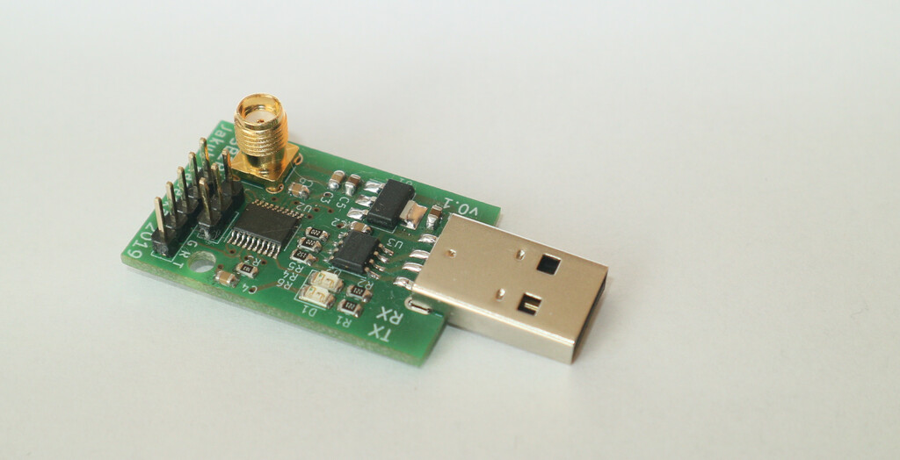

Pneumobil control and telemetry system
======================================

This repository contains source code and board design for control system
of pneumobil racing car Falcon from Brno University of Technology.

Parts
-----
 * HMI - Human Machine Interface - LCD touch screen and telemetry board

 * ECU - Engine Control Unit - Control system of pneumatic propulsion system

 * SDU - Speed Display Unit

 * PSU - Power Supply Unit

 * Radio2usb - Telemetry receiving system

Description
-----------
Placement in the car

Python telemetry program

